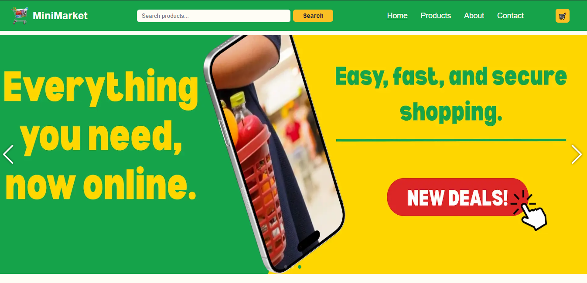
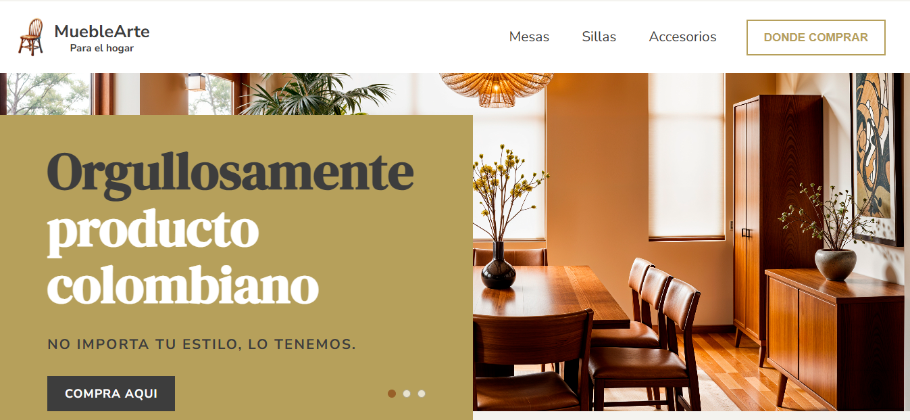
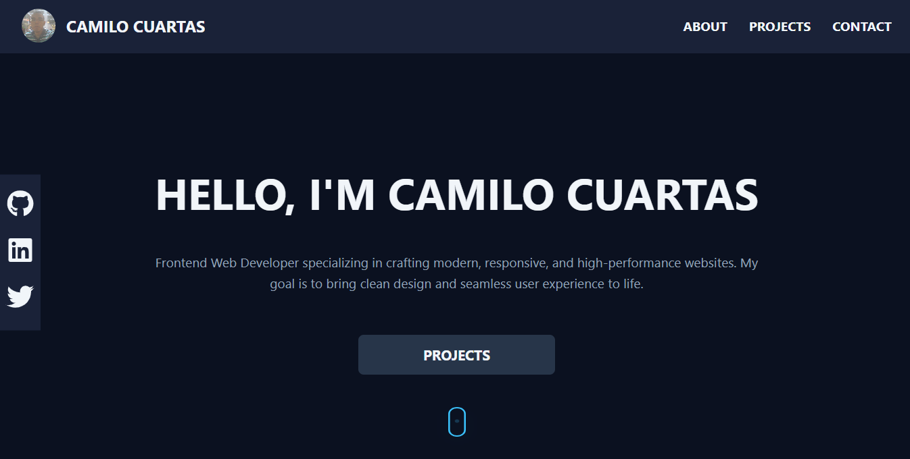

# 🌐 Personal Portfolio - Camilo Cuartas

This is my personal portfolio website built with **React** and **Vite**, designed to showcase my skills, projects, and experience as a **Frontend Developer**. It is fully responsive, following modern UI/UX practices, and optimized for performance.


-   **Live Demo:** [https://portfolio-pink-pi.vercel.app/](https://portfolio-pink-pi.vercel.app/)

---

## 📋 Features

- **Responsive Design** – Works seamlessly across mobile, tablet, and desktop.
- **Modern Tech Stack** – Built with React + Vite for fast development and optimized builds.
- **Interactive UI** – Smooth animations and transitions for an engaging user experience.
- **Dark Mode Styling** – Custom color palette for a professional, elegant look.
- **Project Showcase** – Includes real-world projects with descriptions and links.
- **Contact Section** – Allows visitors to get in touch easily.

---

## 🛠️ Technologies Used

- **Frontend**: HTML5, CSS3, JavaScript (ES6+), React
- **Build Tool**: Vite
- **Version Control**: Git, GitHub
- **Deployment**: *(Deployed using [Vercel](https://vercel.com))*
- **Design Tools**: Figma (for layout and visual planning)

---

---
## ✨ Projects

### MiniMarket - React E-commerce

A complete front-end simulation of an online minimarket. This project demonstrates a full e-commerce experience, including a dynamic shopping cart with state persistence (`localStorage`), client-side routing, performance optimizations, and 404 error handling.

-   **Live Demo:** [https://mini-market-eosin.vercel.app/](https://mini-market-eosin.vercel.app/)
-   **Repository:** [https://github.com/camilo-cloud/MiniMarket-React](https://github.com/camilo-cloud/MiniMarket-React)
-   **Technologies Used:** React, Vite, React Router, CSS, localStorage

## 📸 Preview


---

### MuebleArte

A responsive furniture e-commerce landing page built with React and Vite. This project demonstrates skills in building modern and responsive web designs from scratch.

-   **Live Demo:** [https://camilo-cloud.github.io/pagina-muebles/](https://camilo-cloud.github.io/pagina-muebles/)
-   **Repository:** [https://github.com/camilo-cloud/pagina-muebles](https://github.com/camilo-cloud/pagina-muebles)
-   **Technologies Used:** React, Vite, CSS


## 📸 Preview


---


## 📂 Project Structure

```
portfolio/
├── public/              # Static assets
├── src/
│   ├── assets/          # Images, icons, etc.
│   ├── components/      # Reusable UI components
│   ├── data/            # Projects Data
│   ├── styles/          # CSS files and variables
│   ├── App.jsx          # Main application component
│   ├── App.css          # CSS App style
│   ├── main.jsx         # Entry point
├── package.json
├── README.md
└── vite.config.js
```

---

## 🚀 Getting Started

Follow these steps to run the project locally.

### 1. Clone the repository
```bash
git clone https://github.com/your-username/portfolio.git
cd portfolio
```

### 2. Install dependencies
```bash
npm install
```

### 3. Run the development server
```bash
npm run dev
```

### 4. Build for production
```bash
npm run build
```

---

## 📸 Preview




---

## 📫 Contact

If you want to collaborate, hire me, or just say hello:

- **LinkedIn**: [linkedin.com/in/camilo-cuartas-dev](https://www.linkedin.com/in/camilo-cuartas-dev/)
- **GitHub**: [github.com/camilo-cloud](https://github.com/camilo-cloud)
- **Email**: [recursosyapps@gmail.com](mailto:recursosyapps@gmail.com)

---

## 📝 License

This project is licensed under the [MIT License](LICENSE).
